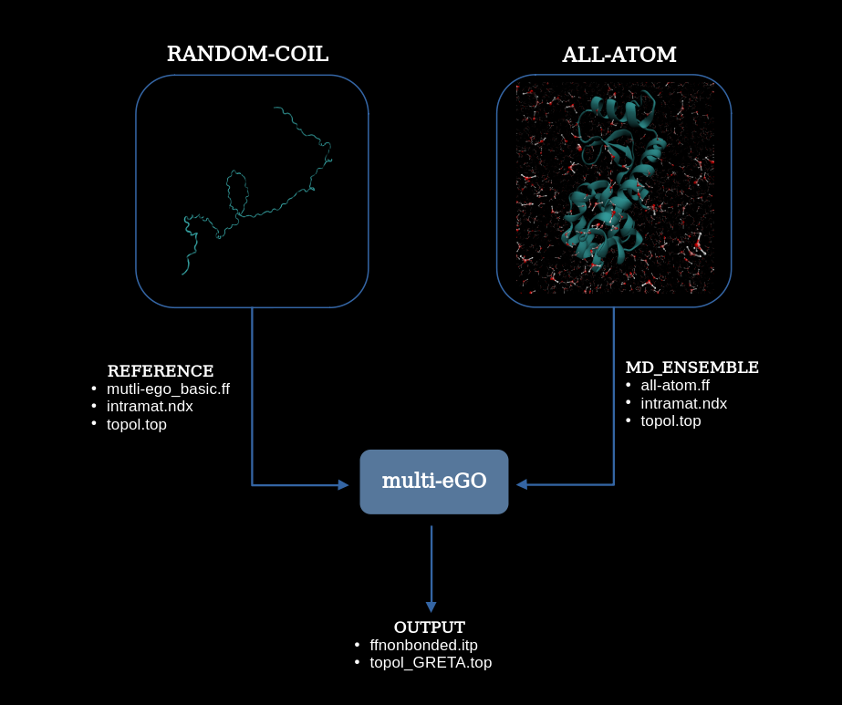

# Multi-*e*GO: a multi-ensemble Gō model
[](https://github.com/multi-ego/multi-eGO/releases)
[](http://www.gnu.org/licenses/gpl-3.0)
[](https://github.com/psf/black)
[](https://github.com/multi-ego/multi-eGO/actions/workflows/test.yml)
[](https://github.com/multi-ego/multi-eGO/actions/workflows/cmdata.yml)
[](https://github.com/multi-ego/multi-eGO/actions/workflows/github-code-scanning/codeql)

## Current Developers:
- Fran Bacic Toplek
- Carlo Camilloni
- Riccardo Capelli
- Bruno Stegani
  
Original version by Emanuele Scalone, Cristina Paissoni, and Carlo Camilloni, [Computational Structural Biology Lab](http://compsb.unimi.it), Department of Biosciences, University of Milano, Italy.

## Table of Contents
- [Requirements](#requirements)
- [Installation](#installation)
- [Usage](#usage)
- [Cite us](#cite-us)

## Requirements
Multi-*e*GO force fields and tools are intended to be used with [GROMACS](https://www.gromacs.org), currently suggested versions are 2023 and 2024.
You will need to know how to compile GROMACS from source, as some multi-eGO tools require GROMACS to be recompiled.

## Installation
Use ```conda``` and the environment file provided as
 ```
conda env create -f conda/environment.yml
conda activate meGO
```
It is also possible to use ``pip install -r requirements.txt``.

To install the `cmdata` see [here](tools/cmdata/README.md)

## Usage
- [Preparing your first multi-eGO system](#preparing-your-first-multi-ego-system)
- [Analysis of a training simulation](#analysis-of-a-training-simulation)
- [Setup of a multi-*e*GO random coil simulation](#setup-of-a-multi-ego-random-coil-simulation)
- [Setup of a multi-eGO production simulation](#setup-of-a-multi-ego-production-simulation)



### Preparing your first multi-*e*GO system

[Back to Usage](#usage)

The first step in running a multi-*e*GO simulation is to create a GROMACS topology file ```(.top)```. 
Copy your PDB file and the ```multi-ego-basic.ff/``` included here into a folder, then run 
```
gmx pdb2gmx -f file.pdb -ignh
```
and select the multi-ego-basic forcefield. This should give you a ```(.gro)``` file for your structure and a ```(.top)``` topology file. In the ```multi-eGO/inputs``` folder, add a folder for your system and a ```reference/``` subfolder. Copy your GROMACS topology into this ```reference/``` subfolder so that the final structure looks like this:
```
└── input
      └──  system_name
               └── reference
                      ├── topol.top
                      └── multi-eGO_basic.ff
```

### Analysis of a training simulation

[Back to Usage](#usage)

Assuming that a training simulation has already been run, two steps are required to learn the interactions from that simulation. First, one need to extract the contact data from the simulation. To do this you can use the ```cmdata``` tool. The tool has to be installed by recompiling GROMACS, see [Installation](#Installation). 

```
cmdata -f $YOUR_TRAJECTORY.xtc -s $YOUR_TOPOLOGY.tpr
```
```cmdata``` reads a trajectory and a GROMACS run input file. The output will be a collection of histograms in the form of ```.dat``` text files. These files then need to be processed to obtain contact distances and probabilities. To do this one can use ```tools/make_mat/make_mat.py``` as follows, assuming that the histograms are located in the md simulation directory in a subdirectory called ```histo/```:
```
python tools/make_mat/make_mat.py --histo $MD_DIRECTORY/histo --target_top $MD_DIRECTORY/topol.top --mego_top inputs/$SYSTEM_NAME/reference/topol.top --out inputs/$SYSTEM_NAME/md_ensemble
```

Finally, you need to copy the topology, force field and contact files into an appropriate folder, such as

```
└── input
      └──  system_name
               ├── reference
               │      ├── topol.top
               │      └── multi-eGO_basic.ff
               └── md_ensemble
                      ├── topol.top
                      ├── intramat_1_1.ndx
                      └── all-atom.ff
```

### Setup of a multi-*e*GO random coil simulation

[Back to Usage](#usage)

Create a folder in which you want to run the random coil simulation. Copy the ```multi-ego-basic.ff/``` folder and the ```.gro``` file generated in the first step into this folder. To generate a random coil force field and associated topology run
```
python multiego.py --system $SYSTEM_NAME --egos rc
```
```multiego.py``` will then create an output directory in ```multi-eGO/outputs/${SYSTEM_NAME}_rc``` which provides the inputs for the random coil simulation.
The contents of the output folder are ```ffnonbonded.itp``` and ```topol_mego.top```. The former is the non-bonded interaction file and needs to be copied into the ```multi-ego-basic.ff/``` folder. The latter needs to be placed in the simulation root directory. We provide ```mdps``` simulation setup files tested with various multi-*e*GO setups in the ```multi-eGO/mdps``` folder. The order in which the simulations are run is as follows:

```
    1. ff_em.mdp
    2. ff_cg.mdp
    3. ff_aa-posre.mdp
    4. ff_rc.mdp
```

Once the random coil simulation is done, you need to analyse it using ```cmdata``` and ```make_mat.py``` as before:

```
cmdata -f $YOUR_TRAJECTORY.xtc -s $YOUR_TOPOLOGY.tpr
python tools/make_mat/make_mat.py --histo $RC_DIRECTORY/histo --target_top $RC_DIRECTORY/topol.top --mego_top inputs/$SYSTEM_NAME/reference/topol.top --out inputs/$SYSTEM_NAME/reference
```

This is the final structure of the input folders:

```
└── input
      └──  system_name
               ├── reference
               │      ├── topol.top
               │      ├── intramat_1_1.ndx
               │      └── multi-eGO_basic.ff
               └── md_ensemble
                      ├── topol.top
                      ├── intramat_1_1.ndx
                      └── all-atom.ff
```

### Setup of a multi-*e*GO production simulation 

[Back to Usage](#usage)

To setup a multi-*e*GO production simulation, you need to run ```multiego.py``` again. Before running the code, make sure that the topologies of your systems all have the same *moleculetype* name. If they do not, you need to change the name in the ```topol.top``` file or the program will crash.
```
python multiego.py --system $SYSTEM_NAME --egos production --epsilon 0.3 --train md_ensemble
```
Here one sets the energy scale &#949; to 0.3 kJ/mol and trains the model from the ```md_ensemble``` data. The output directory will be ```multi-eGO/outputs/${SYSTEM_NAME}_production_e0.3_0.3``` and will contain the inputs for the production simulation. Again, the contents of the output directory are ```ffnonbonded.itp``` and ```topol_mego.top``` and need to be copied to the ```multi-ego-basic.ff/``` folder and the simulation root directory. The ```mdps``` files are the same except for the last step which is now ```ff_aa.mdp```.

Happy simulating :)

## Cite us
1. Scalone, E., et al. [Multi-eGO: An in silico lens to look into protein aggregation kinetics at atomic resolution.](https://www.pnas.org/doi/10.1073/pnas.2203181119) Proc Natl Acad Sci USA 119, e2203181119 (2022); preprint available: [bioRxiv](https://www.biorxiv.org/content/10.1101/2022.02.18.481033v2)
2. Bacic Toplek, F., Scalone, E., et al. [Multi-eGO: model improvements towards the study of complex self-assembly processes.](https://doi.org/10.1021/acs.jctc.3c01182) J. Chem. Theory Comput. 20, 459-468 (2024); preprint available: [chemRxiv](https://doi.org/10.26434/chemrxiv-2023-67255)

